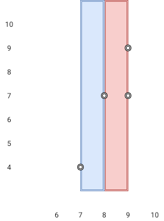

# 两点之间不包含任何点的最宽垂直区域

给你 `n` 个二维平面上的点 `points` ，其中 `points[i] = [xi, yi]` ，请你返回两点之间内部不包含任何点的 **最宽垂直区域** 的宽度。

**垂直区域** 的定义是固定宽度，而 y 轴上无限延伸的一块区域（也就是高度为无穷大）。 **最宽垂直区域** 为宽度最大的一个垂直区域。

请注意，垂直区域 **边上** 的点 **不在** 区域内。

## 示例 1：

>### 输入：
>points = [[8,7],[9,9],[7,4],[9,7]]
>### 输出：
>1
>### 解释：
>红色区域和蓝色区域都是最优区域。

# 示例 2：

>### 输入：
>points = [[3,1],[9,0],[1,0],[1,4],[5,3],[8,8]]
>### 输出：
>3

## 代码：

1.

    public class Solution {
        public int MaxWidthOfVerticalArea(int[][] points) {
            Array.Sort(points, (a, b) => a[0] - b[0]);
            int mx = 0;
            for (int i = 1; i < points.Length; i++) {
                mx = Math.Max(points[i][0] - points[i - 1][0], mx);
            }
            return mx;
        }
    }
2.

    public class Solution {
        public int MaxWidthOfVerticalArea(int[][] points) {
            int n = points.Length;
            int[] xVals = new int[n];
            for (int i = 0; i < n; i++) {
                xVals[i] = points[i][0];
            }
            Array.Sort(xVals);
            int maxWidth = 0;
            for (int i = 1; i < n; i++) {
                int width = xVals[i] - xVals[i - 1];
                maxWidth = Math.Max(maxWidth, width);
            }
            return maxWidth;
        }
    }
3.

    public class Solution {
        public int MaxWidthOfVerticalArea(int[][] points) {
            List<int> num=new List<int>();
            for(int i=0;i<points.Length;i++){
                num.Add(points[i][0]);
            }
            num.Sort();
            int max=0;
            for(int n=1;n<points.Length;n++){
                if(max<num[n]-num[n-1]){
                    max=num[n]-num[n-1];
                }
            }
            return max;
        }
    }
